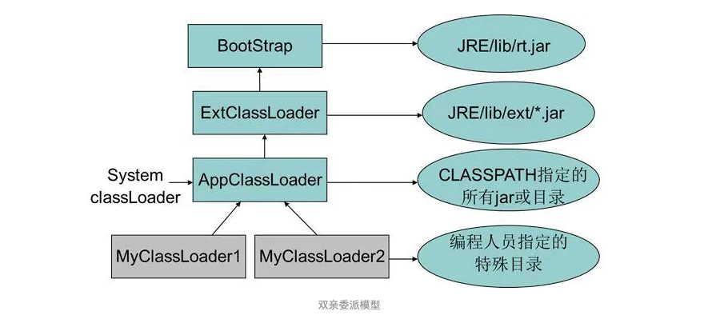

## 此项目主要用于学习jdk基础源码相关测试案例

### 类加载器

#### 作用
> 将类的class字节码文件二进制流加载到内存，注意这里只是加载内存，并没有将二进制流的存储结构解析并写入方法区
#### 分类
##### 启动类加载器（Bootstrap ClassLoader 引导类加载器）
> 这个类负责将放在<JAVA_HOME>\lib目录下，并且是虚拟机识别的（仅仅按照文件名识别，名字不符合的类库即使在lib目录下也不会被夹在）类库加载到虚拟机内存中。启动类加载器无法被java程序直接引用，如果要把加载请求委派给启动类加载器，那就直接用null代替即可。

##### 扩展类加载器（Extension ClassLoader）
> 负责加载<JAVA_HOME>\lib\ext目录下的类库

##### 应用程序类加载器（Application ClassLoader）也称为系统类加载器
> 负责加载用户类路径上所指定的类库，如果应用程序中没有自定义过自己的类加载器，一般情况下这个就是程序中默认的类加载器。一般情况下，我们自己写的类是由这个加载器加载。

